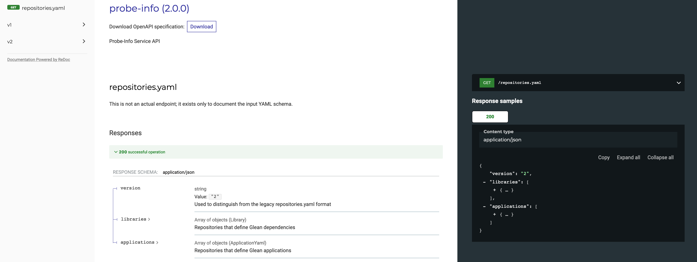

# probe-scraper
Scrape Telemetry probe data from Firefox repositories.

This extracts per-version Telemetry probe data for Firefox and other Mozilla products from registry files like Histograms.json and Scalars.yaml.
The data allows answering questions like "which Firefox versions is this Telemetry probe in anyway?".
Also, probes outside of Histograms.json - like the CSS use counters - are included in the output data.

The data is pulled from two different sources:
- From [`hg.mozilla.org`](https://hg.mozilla.org) for Firefox data.
- From a [configurable set of Github repositories](repositories.yaml) that use [Glean](https://github.com/mozilla-mobile/android-components/tree/master/components/service/glean).

Probe Scraper outputs JSON to https://probeinfo.telemetry.mozilla.org.
Effectively, this creates a REST API which can be used by downstream tools like
[mozilla-schema-generator](https://github.com/mozilla/mozilla-schema-generator)
and various data dictionary type applications (see below).

An [OpenAPI reference](https://mozilla.github.io/probe-scraper/) to this API is available:

<a href="https://mozilla.github.io/probe-scraper/" rel="probeinfo API docs"></a>

A web tool to explore the Firefox-related data is available at [probes.telemetry.mozilla.org](https://probes.telemetry.mozilla.org/). A project to develop a similar view for Glean-based data
is under development in the [Glean Dictionary](https://github.com/mozilla/glean-dictionary).


## Adding a New Glean Repository

To scrape a git repository for probe definitions, an entry needs to be added in `repositories.yaml`.
The exact format of the entry depends on whether you are adding an application or a library. See below for details.

### Adding an application

For a given application, Glean metrics are emitted by the application itself, any libraries it uses
that also use Glean, as well as the Glean library proper. Therefore, probe scraper needs a way to
find all of the dependencies to determine all of the metrics emitted by
that application.

Therefore, each application should specify a `dependencies` parameter, which is a list of Glean-using libraries used by the application.  Each entry should be a library name as specified by the library's `library_names` parameter.

For Android applications, if you're not sure what the dependencies of the application are, you can run the following command at the root of the project folder:

```bash
$ ./gradlew :app:dependencies
```

See the full [application schema documentation](https://mozilla.github.io/probe-scraper/#tag/application)
for descriptions of all the available parameters.

### Adding a library

Probe scraper also needs a way to map dependencies back to an entry in the
`repositories.yaml` file. Therefore, any libraries defined should also include
their build-system-specific library names in the `library_names` parameter.

See the full [library schema documentation](https://mozilla.github.io/probe-scraper/#tag/library)
for descriptions of all the available parameters.

## Developing the probe-scraper

You can choose to develop using the container, or locally. Using the container will be slower, since changes will trigger a rebuild of the container.
But using the container method will ensure that your PR passes CircleCI build/test phases.

### Local development

Install the requirements:
```
pip install -r requirements.txt
pip install -r test_requirements.txt
python setup.py develop
```

Run tests. This by default does not run tests that require a web connection:
```
pytest tests/
```

To run all tests, including those that require a web connection:
```
pytest tests/ --run-web-tests
```

To test whether the code conforms to the style rules, you can run:
```
flake8 --max-line-length 100 .
```

To render API documentation locally to `index.html`:
```
make apidoc
```

### Developing using the container

Run tests in container. This does not run tests that require a web connection:
```
export COMMAND='pytest tests/'
make run
```

To run all tests, including those that require a web connection:
```
make test
```

To test whether the code conforms to the style rules, you can run:
```
make lint
```

### Tests with Web Dependencies

Any tests that require a web connection to run should be marked with `@pytest.mark.web_dependency`.

These will not run by default, but will run on CI.

### Performing a Dry-Run

Before opening a PR, it's good to test the code you wrote on the production data. You can specify a specific Firefox
version to run on by using `first-version`:
```
export COMMAND='python -m probe_scraper.runner --firefox-version 65 --dry-run'
make run
```
or locally via:
```
python -m probe_scraper.runner --firefox-version 65 --dry-run
```

Including `--dry-run` means emails will not be sent.

Additionally, you can test just on Glean repositories:
```
export COMMAND='python -m probe_scraper.runner --glean --dry-run'
make run
```

By default that will test against every Glean repository, which might take a while. If you want to test against just one (e.g. a new repository you're adding), you can use the `--glean-repo` argument to just test the repositories you care about:
```
export COMMAND='python -m probe_scraper.runner --glean -glean-repo glean-core --glean-repo glean-android --glean-repo burnham --dry-run'
make run
```

Replace burnham in the example above with your repository and its dependencies.

You can also do the dry-run locally:

```
python -m probe_scraper.runner --glean --glean-repo glean-core --glean-repo glean-android --glean-repo burnham --dry-run
```

## Module overview

The module is built around the following data flow:

- scrape registry files from mozilla-central, clone files from repositories directory
- extract probe data from the files
- transform probe data into output formats
- save to disk

The code layout consists mainly of:

- `probe_scraper`
  - `runner.py` - the central script, ties the other pieces together
  - `scrapers`
     - `buildhub.py` - pull build info from the [BuildHub](https://buildhub.moz.tools) service
     - `moz_central_scraper.py` - loads probe registry files for multiple versions from mozilla-central
     - `git_scraper.py` - loads probe registry files from a git repository (no version or channel support yet, just per-commit)
  - `parsers/` - extract probe data from the registry files
     - `third_party` - these are imported parser scripts from [mozilla-central](https://dxr.mozilla.org/mozilla-central/source/toolkit/components/telemetry/)
   - `transform_*.py` - transform the extracted raw data into output formats
- `tests/` - the unit tests

## Accessing the data files
The processed probe data is serialized to the disk in a directory hierarchy starting from the provided output directory. The directory layout resembles a REST-friendly structure.

    |-- product
        |-- general
        |-- revisions
        |-- channel (or "all")
            |-- ping type
                |-- probe type (or "all_probes")

For example, all the JSON probe data in the [main ping]() for the *Firefox Nightly* channel can be accessed with the following path: `firefox/nightly/main/all_probes`. The probe data for all the channels (same product and ping) can be accessed instead using `firefox/all/main/all_probes`.

The root directory for the output generated from the scheduled job can be found at <https://probeinfo.telemetry.mozilla.org/>.
All the probe data for Firefox coming from the main ping can be found at <https://probeinfo.telemetry.mozilla.org/firefox/all/main/all_probes>.

## Accessing `Glean` metrics data
Glean data is generally laid out as follows:

```
| -- glean
    | -- repositories
    | -- general
    | -- repository-name
        | -- general
        | -- metrics
```

For example, the data for a repository called `fenix` would be found at [`/glean/fenix/metrics`](https://probeinfo.telemetry.mozilla.org/glean/fenix/metrics). The time the data was last updated for that project can be found at [`glean/fenix/general`](https://probeinfo.telemetry.mozilla.org/glean/fenix/general).

A list of available repositories is at [`/glean/repositories`](https://probeinfo.telemetry.mozilla.org/glean/repositories).
